## `Mermaid`的样式

   

# 流程图

## 定义流程图方向
#### 先定义图向的方向如下图所示:

用词 flowchart x; | 含义 
-------|-------
`TB` | 从上到下 
`BT` | 从下到上 
`LR` | 从左到右 
`RL` | 从右到左 


### 1. 从上到下

```js
flowchart TB
    A --> B
```

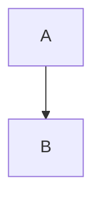

### 2. 从下到上

```js
flowchart BT
    A --> B
```

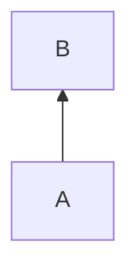

### 3. 从左到右 

```js
flowchart LR
    A --> B
```

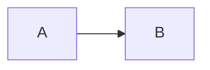


### 4. 从右到左

```js
flowchart RL
    A --> B
```

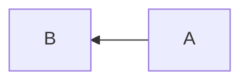


## 定义节点的样式
#### 节点之间的连线: 

### 节点1

```js
flowchart LR
    id1(This is the text in the box)
```

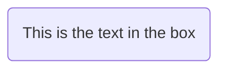

### 节点2

```js
flowchart LR
    id1([one])
    id2(two)
    id1-->id2
```

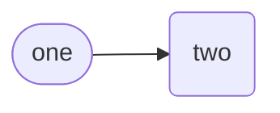


### 节点3

```js
flowchart LR
    id1[[This is the text in the box]]
```

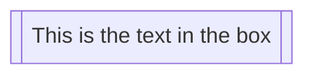


### 节点4

```js
flowchart LR
    id1[(Database)]
```

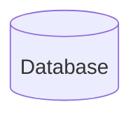


### 节点5

```js
flowchart LR
    id1((This is the text in the circle))
```

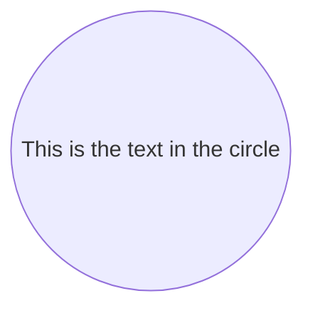


### 节点6

```js
flowchart LR
    id1>This is the text in the box]
```

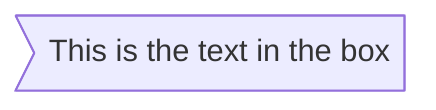


### 节点7

```js
flowchart LR
    id1{This is the text in the box}
```

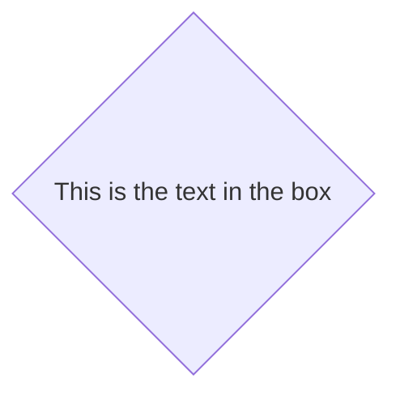


### 节点8

```js
flowchart LR
    id1{{This is the text in the box}}
```

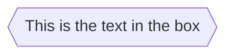


### 节点9

```js
flowchart RL
    id1[/This is the text in the box/]
```

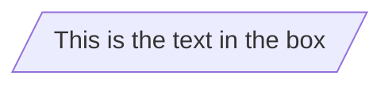

### 节点10

```js
flowchart RL
    id1[\This is the text in the box\]
```

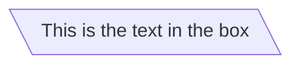

### 节点11

```js
flowchart RL
    A[/Christmas\]
```

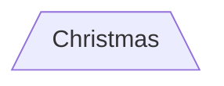

### 节点12

```js
flowchart RL
    A[/Christmas\]
```


### 节点13

```js
flowchart RL
    B[\Go shopping/]
```

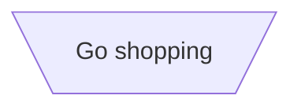
### 节点14

```js
flowchart RL
    id1(((This is the text in the circle)))
```

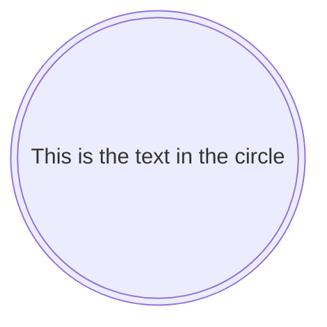


## 定义节点的连线样式
#### 节点之间的连线: 

 箭头 | 含义
---------|-------
 `>` | 添加尾部箭头
 `-` | 不添加尾部箭头
 `--` | 单线
 `--text--` | 单线加文字
`==` | 粗线
`==text==` | 粗线加文字
`-.-` | 虚线
`-.text.-` | 虚线加文字


## 带箭头点与点连接样式

### 样式1

```js
flowchart LR
    A-->|text|B
```

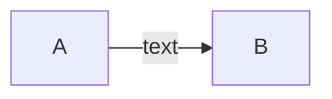


### 样式2

```js
flowchart LR
    A-- text -->B
```

```mermaid
flowchart LR
    A-- text -->B
```


### 样式3

```js
flowchart LR;
   A-.->B;
```

```mermaid
flowchart LR;
   A-.->B;
```


### 样式4

```js
flowchart LR
   A-. text .-> B
```

```mermaid
flowchart LR
   A-. text .-> B
```


### 样式5

```js
flowchart LR
   A ==> B
```

```mermaid
flowchart LR
   A ==> B
```


### 样式6

```js
flowchart LR
   A == text ==> B
```

```mermaid
flowchart LR
   A == text ==> B
```


### 样式7

```js
flowchart LR
   A -- text --> B -- text2 --> C
```

```mermaid
flowchart LR
   A -- text --> B -- text2 --> C
```


### 样式8

```js
flowchart LR
   a --> b & c--> d
```

```mermaid
flowchart LR
   a --> b & c--> d
```


### 样式9

```js
flowchart TB
    A & B--> C & D
```

```mermaid
flowchart TB
    A & B--> C & D
```


### 样式10

```js
flowchart TB
    A --> C
    A --> D
    B --> C
    B --> D
```

```mermaid
flowchart TB
    A --> C
    A --> D
    B --> C
    B --> D
```

### 样式11

```js
flowchart LR
    A --o B
    B --x C
```

```mermaid
flowchart LR
    A --o B
    B --x C
```

### 样式12

```js
flowchart LR
    A o--o B
    B <--> C
    C x--x D
```

```mermaid
flowchart LR
    A o--o B
    B <--> C
    C x--x D
```

### 样式13

```js
flowchart TD
    A[Start] --> B{Is it?}
    B -->|Yes| C[OK]
    C --> D[Rethink]
    D --> B
    B ---->|No| E[End]
```

```mermaid
flowchart TD
    A[Start] --> B{Is it?}
    B -->|Yes| C[OK]
    C --> D[Rethink]
    D --> B
    B ---->|No| E[End]
```


### 样式14

```js
flowchart TD
    A[Start] --> B{Is it?}
    B -- Yes --> C[OK]
    C --> D[Rethink]
    D --> B
    B -- No ----> E[End]
```

```mermaid
flowchart TD
    A[Start] --> B{Is it?}
    B -- Yes --> C[OK]
    C --> D[Rethink]
    D --> B
    B -- No ----> E[End]
```


## 子图样式

子图语法样式:


```
subgraph title
    graph definition
end
```


### 子图样式1

```js
flowchart TB
    c1-->a2
    subgraph one
    a1-->a2
    end
    subgraph two
    b1-->b2
    end
    subgraph three
    c1-->c2
    end
```

```mermaid
flowchart TB
    c1-->a2
    subgraph one
    a1-->a2
    end
    subgraph two
    b1-->b2
    end
    subgraph three
    c1-->c2
    end
```


### 子图样式2

```js
flowchart TB
    c1-->a2
    subgraph one
    a1-->a2
    end
    subgraph two
    b1-->b2
    end
    subgraph three
    c1-->c2
    end
    one --> two
    three --> two
    two --> c2
```

```mermaid
flowchart TB
    c1-->a2
    subgraph one
    a1-->a2
    end
    subgraph two
    b1-->b2
    end
    subgraph three
    c1-->c2
    end
    one --> two
    three --> two
    two --> c2
```


### 子图样式3

```js
flowchart LR
  subgraph TOP
    direction TB
    subgraph B1
        direction RL
        i1 -->f1
    end
    subgraph B2
        direction BT
        i2 -->f2
    end
  end
  A --> TOP --> B
  B1 --> B2
```

```mermaid
flowchart LR
  subgraph TOP
    direction TB
    subgraph B1
        direction RL
        i1 -->f1
    end
    subgraph B2
        direction BT
        i2 -->f2
    end
  end
  A --> TOP --> B
  B1 --> B2
```


### class diagram

```mermaid
classDiagram
Class01 <|-- AveryLongClass : Cool
Class03 *-- Class04
Class05 o-- Class06
Class07 .. Class08
Class09 --> C2 : Where am i?
Class09 --* C3
Class09 --|> Class07
Class07 : equals()
Class07 : Object[] elementData
Class01 : size()
Class01 : int chimp
Class01 : int gorilla
Class08 <--> C2: Cool label
```

示例代码:

```
classDiagram
    Class01 <|-- AveryLongClass : Cool
    Class03 *-- Class04
    Class05 o-- Class06
    Class07 .. Class08
    Class09 --> C2 : Where am i?
    Class09 --* C3
    Class09 --|> Class07
    Class07 : equals()
    Class07 : Object[] elementData
    Class01 : size()
    Class01 : int chimp
    Class01 : int gorilla
    Class08 <--> C2: Cool label
```


### git Graph

```mermaid
%%{init: { 'logLevel': 'debug', 'theme': 'base' } }%%
      gitGraph
        commit
        branch hotfix
        checkout hotfix
        commit
        branch develop
        checkout develop
        commit id:"ash" tag:"abc"
        branch featureB
        checkout featureB
        commit type:HIGHLIGHT
        checkout main
        checkout hotfix
        commit type:NORMAL
        checkout develop
        commit type:REVERSE
        checkout featureB
        commit
        checkout main
        merge hotfix
        checkout featureB
        commit
        checkout develop
        branch featureA
        commit
        checkout develop
        merge hotfix
        checkout featureA
        commit
        checkout featureB
        commit
        checkout develop
        merge featureA
        branch release
        checkout release
        commit
        checkout main
        commit
        checkout release
        merge main
        checkout develop
        merge release
```

### flow chart

```mermaid
flowchart TD
    B["fa:fa-twitter for peace"]
    B-->C[fa:fa-ban forbidden]
    B-->D(fa:fa-spinner);
    B-->E(A fa:fa-camera-retro perhaps?)
```


### flow chart

```mermaid
flowchart LR
    A[Hard edge] -->|Link text| B(Round edge)
    B --> C{Decision}
    C -->|One| D[Result one]
    C -->|Two| E[Result two]
		D --> A
```


```mermaid
graph LR
emperor((朱八八))-.子.->朱五四-.子.->朱四九-.子.->朱百六


朱雄英--长子-->朱标--长子-->emperor
emperor2((朱允炆))--次子-->朱标
朱樉--次子-->emperor
朱棡--三子-->emperor
emperor3((朱棣))--四子-->emperor
emperor4((朱高炽))--长子-->emperor3

```


```mermaid
flowchart TB
    c1-->a2
    subgraph one
    a1-->a2
    end
    subgraph two
    b1-->b2
    end
    subgraph three
    c1-->c2
    end
    one --> two
    three --> two
    two --> c2
```

### 时序图

```mermaid
sequenceDiagram
    participant Alice
    participant Bob
    Alice->John: Hello John, how are you?
    loop Healthcheck
        John->John: Fight against hypochondria
    end
    Note right of John: Rational thoughts <br/>prevail...
    John-->Alice: Great!
    John->Bob: How about you?
    Bob-->John: Jolly good!
```
   

```mermaid
gantt
    dateFormat  YYYY-MM-DD
    title       Adding GANTT diagram functionality to mermaid
    excludes    weekends
    %% (`excludes` accepts specific dates in YYYY-MM-DD format, days of the week ("sunday") or "weekends", but not the word "weekdays".)

    section A section
    Completed task            :done,    des1, 2014-01-06,2014-01-08
    Active task               :active,  des2, 2014-01-09, 3d
    Future task               :         des3, after des2, 5d
    Future task2              :         des4, after des3, 5d

    section Critical tasks
    Completed task in the critical line :crit, done, 2014-01-06,24h
    Implement parser and jison          :crit, done, after des1, 2d
    Create tests for parser             :crit, active, 3d
    Future task in critical line        :crit, 5d
    Create tests for renderer           :2d
    Add to mermaid                      :1d
    Functionality added                 :milestone, 2014-01-25, 0d

    section Documentation
    Describe gantt syntax               :active, a1, after des1, 3d
    Add gantt diagram to demo page      :after a1  , 20h
    Add another diagram to demo page    :doc1, after a1  , 48h

    section Last section
    Describe gantt syntax               :after doc1, 3d
    Add gantt diagram to demo page      :20h
    Add another diagram to demo page    :48h

```


```mermaid
requirementDiagram

    requirement test_req {
    id: 1
    text: the test text.
    risk: high
    verifymethod: test
    }

    element test_entity {
    type: simulation
    }

    test_entity - satisfies -> test_req
```

