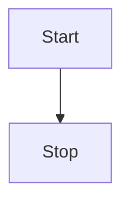

# Mermaid 介M

`Mermaid`是一种基于`Javascript`的绘图工具，使用类似于`Markdown`的语法，使用户可以方便快捷地通过代码创建图表。

[Mermaid 官方网站](https://mermaid-js.github.io/)
[Mermaid github](https://github.com/mermaid-js/mermaid)


## VitePress 安装 Mermaid

使用 `npm` 安装 `Mermaid`

```bash
$ npm i vitepress-plugin-mermaid -s
```

## 配置使用

需要在`.vitepress`的文件中进行配置.


### 在`config`文件配置

在`.vitepress/config.js` 文件中, 增加引入`Mermaid`.

```js
import MermaidPlugin from "vitepress-plugin-mermaid";

module.exports = {
  ...
  markdown: {
    config: MermaidPlugin,
  },
  ...
}
```

#### 配置 `theme`
在`.vitepress/theme/index.js`文件中, 配置使用`Mermaid`.

```js
import DefaultTheme from "vitepress/theme";
import Mermaid from "vitepress-plugin-mermaid/Mermaid.vue";

export default {
  ...DefaultTheme,
  enhanceApp({ app }) {
    // register global components
    app.component("Mermaid", Mermaid);
  },
};
```

#### 配置完成后, 需要在`md`文件中使用.

需要使用在代码块中标记为`mermaid`, 如果下面代码所示:

::: tip 示例代码
<!---any-file.md-->
\`\`\`mermaid

flowchart TD

  Start --> Stop

\`\`\`
:::

上面代码的样式:



可以使用下面的在线工具, 可以实现边编辑边看效果
[Mermaid editor online](https://mermaid-js.github.io/mermaid-live-editor/)